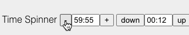

# CA_DurationSpin

Number spinner web component with hh:mm:ss format with holdable button increment/decrement controls.



Displays mm:ss when there are zero hours.

Value returns seconds (>=0).

## Syntax

```html
  <script src="ca_durationspin.js"></script>
  <ca-duration-spin
    max="3700"
    value="3596"
    step="1"
    name="foo"
  >
  </ca-duration-spin>

  <ca-duration-spin
    min="0"
    max="360"
    value="5"
    step="5"
    minus="down"
    plus="up"
  >
  </ca-duration-spin>

  <ca-duration-spin></ca-duration-spin>
```

### Attributes

- [`name`](#name-optional)
- [`min`](#min-optional)
- [`max`](#max-optional)
- [`value`](#value-optional)
- [`step`](#step-optional)
- [`minus`](#minus-optional)
- [`plus`](#plus-optional)

#### name (optional)

The name of input.

#### min (optional)

The smallest value that can be set (default: 0).

#### max (optional)

The largest value that can be set (default: 86400).

#### value (optional)

The initial value of the spinner, otherwise same as 'min'.

#### step (optional)

The rate of numerical change (default: 1).

#### minus (optional)

The label for the minus button (default: -).

#### plus (optional)

The label for the plus buton (default: +).
